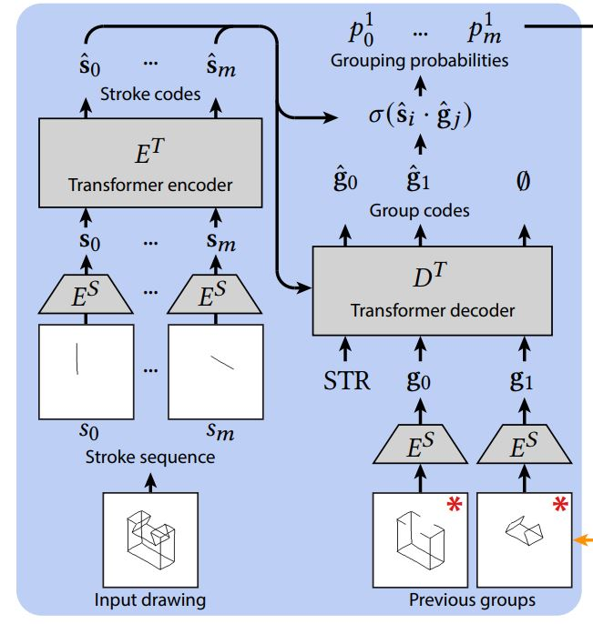

# Free2CAD: Parsing Freehand Drawings into CAD Commands  

## 一、问题定义  

输入笔画的有序序列 $S=[s_i]$，描绘一个复杂形状  
输出 CAD 命令序列 $O=[o_j]$，被执行时较好地再现所描述的复杂形状  

## 二、问题解决  

### 1. 笔画分组  

设笔画 $s_i$ 的栅格图为 $\mathbf I(s_i) \in [0,1]^{256 \times 256}$，笔画分组 $\mathcal G_j$ 相应的图为 $\mathbf I(\mathcal G_j)$  

预训练 CNN 自动编码器：  
设 $E^S$ 为笔画编码器，$D^S$ 为笔画解码器  
最小化重建损失函数 $||\mathbf I(s_i)-D^S(E^S(\mathbf I(s_i)))||^2$  

用 CNN 自动编码器，得到笔画与笔画分组的紧致码：  
$\mathbf s_i=E^S(\mathbf I(s_i))$  
$\mathbf g_j=E^S(\mathbf I(\mathcal G_j))$  

Transformer 编码器 $E^T$ 嵌入所有输入笔画，得到与序列中其它笔画有关的紧致码：  
$\hat{\mathbf s}_i=E^T(\mathbf s_i)$  
Transformer 解码器 $D^T$ 预测当前笔画分组的编码：  
$\hat{\mathbf g}_j=D^T(STR,\mathbf g_0,...,\mathbf g_{j-1};[\hat{\mathbf s}_i])$  

笔画 $s_i$ 属于分组 $\mathcal G_j$ 的概率为：  
$p^j_i=\sigma(\hat{\mathbf s}_i \cdot \hat{\mathbf g}_j)$
其中 $\sigma(\cdot)$ 为 sigmoid 激活函数，$p^j_i>0.5$ 说明笔画 $s_i$ 应该被选择  

训练分组 Transformer：  
最小化二元交叉熵损失函数 $\sum_{\mathcal G_j} \sum_{s_i} (\mathbb I_{s_i \in \mathcal G_j})log(p^j_i)+(1-\mathbb I_{s_i \in \mathcal G_j})log(1-p^j_i)$  
其中 $\mathbb I$ 为指示函数  

笔画分组架构图：  

### 2. 重建 CAD 操作  

设 M 为先前的分组重建的形状， $P_i^j$ 为笔画属于当前分组 $\mathcal G_j$ 的概率  

上下文信息：  
生成 M 的深度和法线贴图 D、N（对于第一个分组 $\mathcal G_0$，用地平面作为上下文）  

基于 CNN 的分割：  
光栅化所有笔画，生成图像 $\mathbf I(S)$，笔画 $s_i$ 的权重为 $P^j_i$  
用 CNN 处理图像 $\mathbf I(S)$ 和上下文贴图 D、N，预测基准面贴图 $\mathbf B_f$ 和基准边贴图 $\mathbf B_e$  

选择基准面和笔画：  
识别覆盖了 $\mathbf B_f$ 中最多的前景像素的面 $f \in M$ 以及覆盖了 $\mathbf B_e$ 中最多的前景像素的笔画 $S' \subset S$  

参数拟合：  
对于闭合笔画，用圆或多边形拟合，获得基准形状  
对于非闭合笔画，用基准面的边界将其闭合  
将基准形状 P 在 f 的法向 $\mathbf n_f$ 上拉伸，找到偏移量 d，使 $P+d \mathbf n_f$ 在剩余笔画 $s_i \in \mathcal G_j \backslash S'$ 重建效果最佳  

重建操作架构图：  

### 3. 迭代评估与校正  

校正错误的分组：  
给定恢复的操作 $o_j$ 产生的 3D 形状，在绘画平面中找到它的特征线，并将它们与未被分到先前组的笔画 $s_i \notin \mathcal G_{0...j-1}$ 匹配  
完全覆盖特征线的笔画：笔画与特征线的双向倒角距离低于阈值 $\epsilon_1$（笔画边界框对角线长度的 2%）  
部分覆盖特征线的笔画：短笔画与长特征线的 Hausdorff 距离低于 $\epsilon_1$  

检测错误的 CAD 操作：  
检测以下两种情况  
（1）基准面或曲线无法从预测贴图 $\mathbf B_e$ 或 $\mathbf B_f$ 中识别  
（2）Transformer 预测的分组与 CAD 操作修正的分组相差超过一半的笔画  
