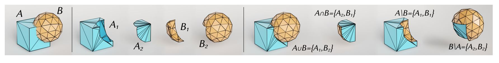
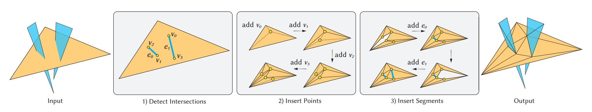
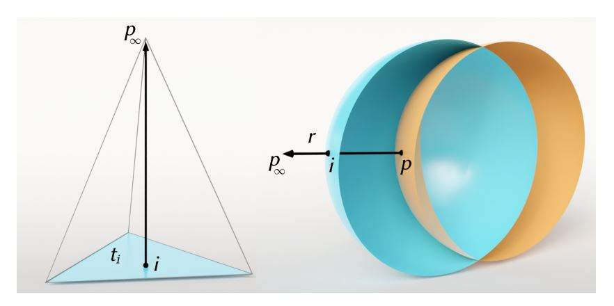
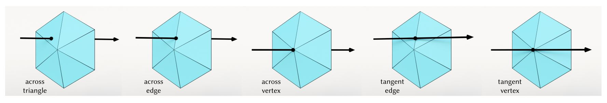

# Interactive and Robust Mesh Booleans  

## 一、问题定义  

输入网格集合 $M_1,M_2,...,M_n$ 和一个布尔运算，即交、并、差  
输出一个网格 B 包含对输入网格应用布尔运算的结果  

## 二、问题解决  

网格布尔运算的实例：  

### 1. 交集分割  

将输入网格 $M_1,M_2,...,M_n$ 看作一组可能相交的三角形，将所有输入三角形放入一个数组中，每个三角形关联一个标签映射到它所在的输入网格  

基于现有的算法：  

  

改进方向：

（1）优化 orient3D 的计算  

给定一个点 p 和一个经过点 a，b，c 的平面，点相对于平面的方向等同于计算以下行列式的符号  

$$
orient3D(a,b,c,p)=
\left|
    \begin{array}{ccc}
    a_x & a_y & a_z & 1 \\ 
    b_x & b_y & b_z & 1 \\ 
    c_x & c_y & c_z & 1 \\
    p_x & p_y & p_z & 1
    \end{array}
\right| 
$$

可将 $4 \times 4$ 行列式改写为  

$$
orient3D(a,b,c,p)=
-p_x
\left|
    \begin{array}{ccc}
    a_y & a_z & 1 \\ 
    b_y & b_z & 1 \\ 
    c_y & c_z & 1
    \end{array}
\right|
+p_y
\left|
    \begin{array}{ccc}
    a_x & a_z & 1 \\ 
    b_x & b_z & 1 \\ 
    c_x & c_z & 1
    \end{array}
\right| 
-p_z
\left|
    \begin{array}{ccc}
    a_x & a_y & 1 \\ 
    b_x & b_y & 1 \\ 
    c_x & c_y & 1
    \end{array}
\right| 
+
\left|
    \begin{array}{ccc}
    a_x & a_y & a_z \\ 
    b_x & b_y & b_z \\ 
    c_x & c_y & c_z
    \end{array}
\right| 
$$

对于每个输入三角形，缓存 4 个 $3 \times 3$ 的行列式，将 orient3D 的调用简化为 4D 点积  

（2）线段插入  

从当前细分曲面中删除所有与该线段冲突的三角形，并对由此产生的多边形重新三角化，确保该线段是新的细分曲面的一部分  

时间复杂度：$O(n^2) \rightarrow O(n)$  
其中 n 为多边形线段数量  

（3）底层数据结构  

优化集合、字典和邻接表存储的稀疏图：  
- 对集合和字典使用 swiss table，节省内存并提高缓存一致性  
- 使用 arena 分配器，降低内存分配器的压力并减少碎片总量  
- 对邻接表使用动态数组  

### 2. 內部 / 外部分类  

输入：网格 $M_1,...,M_n$ 和它们的分割碎块 $P_1,...,P_m$  
输出：碎块 $P_1,...,P_m$ 相对于网格 $M_1,...,M_n$ 的位置  
遍历碎块和网格，对于碎块 $P$ 和网格 $M$：  
定义射线 r，起点为 $p \in P$，终点为无穷远点 $p_\infty$，求 r 和 M 的交点并排序  
若 r 和 M 不相交，则 P 在 M 的外部  
若 r 和 M 相交，找到相交三角形 $t \in M$，计算四面体 $(t,p_\infty)$ 的有向体积  
若有向体积为正，则 P 在 M 的外部  
若有向体积为负，则 P 在 M 的内部  

（1）射线定义  

若碎块 P 不包含输入顶点或根本不包含内部顶点：  

定义起点位于 P 下方并保证在某个内部点 $p \in P$ 穿过碎块的射线  
对射线与网格的所有交点排序，跳过所有出现在 p 之前的交点，只考虑出现在 p 后的第一个交点来进行内部 / 外部分类  

随机选取一个三角形 $t \in P$ 并将其隐式顶点坐标转换为显式浮点数，近似计算三角形的重心 $b_t$，将 $b_t$ 沿着用于定义 $p_\infty$ 的轴向后移动以确保 $b_t$ 位于三角形 t 的下方  
若射线与碎块不相交，用 P 的另一个三角形进行同样的构造，直到找到有效的那一个  
若找不到有效的三角形，用有理数计算精确的重心并进行精确的射线投影  

（2）交点检测  

使用八叉树作为加速结构  

（3）分类  

若射线与碎块三角形不在内部点相交，给 $p_\infty$ 坐标一个扰动 $\epsilon$，直到相交于网格三角形的内部点  

